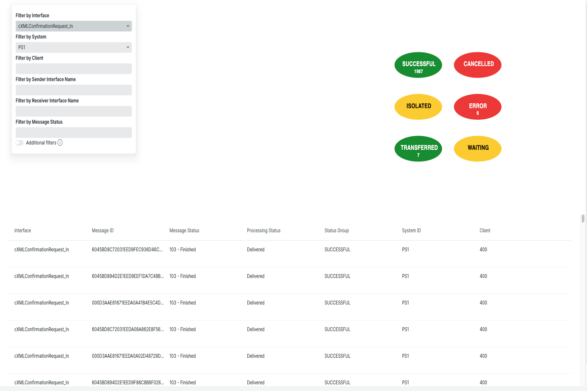
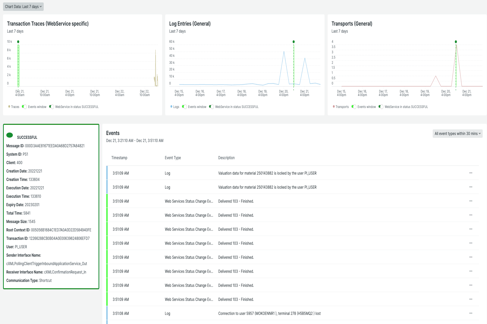

[](https://opensource.newrelic.com/oss-category/#new-relic-one-catalog-project)

# ABAP Web Services Explorer

  [](https://snyk.io/test/github/newrelic/nr1-sap-webservices)

SAP ABAP Web services are one of the standardized ways used by SAP for communication between SAP systems, and between SAP and non-SAP systems. 

These Web Services packets get assigned various statuses as they go thrhough various steps in the process to get to their destination. New Relic's SAP ABAP Web Services Explorer helps SAP users visualize the entire ABAP Web Services process to ensure that they get to their destinations in a timely manner, or in case of errors and failures diagnose the root cause of the problems and provide timely solution to reduce the Mean Time to Resolution.

ABAP Web Services Explorer provides a list of all ABAP Web Services within as sdpecified time range faceted by their "Message_ID" fields, based on a set of filters including "Interface", "System ID", "Client", "sender and/or receiver's interface name", "Message Status", "Message ID", and more, along with a graphical view that provides the number of messages in each state.



Selecting a particular message would take the user to a details page where it shows more details including the message details, charts of transaction traces, Logs, and SAP Transports. Additionally below the charts it shows a list of all Web Services events, traces, logs, and transports where the user can select one event and get more details for Log and Trace events in New Relic's Observability for Logs, and for Distributed Traces.



The SAP ABAP Web Services Explorer requires the installation of the New Relic Monitoring for SAP Solutions on the monitored SAP systems.  Please refer to the [installation guide](https://drive.google.com/file/d/1ldVOF2Bo88nVBKn7ai1RIb7Sn6HhmFvI/view?usp=sharing) for more details. 

## Open source license

This project is distributed under the [Apache 2 license](LICENSE).

## Install using New Relic One Application Catalog

This application is primarily designed to be installed via the New Relic Application Catalog.

In [New Relic One](https://one.newrelic.com), navigate to your Apps section and click the "ABAP Web Services Explorer" application. The Manage Access button in the top right will let you choose the account where you want to make this app visible. It will be visible to all users of that account.

## Install using New Relic One CLI

SAP ABAP Web Services Explorer is also an Open Source application. You can quickly and easily deploy it manually using the New Relic One CLI.

Ensure you have [git](https://git-scm.com/book/en/v2/Getting-Started-Installing-Git) and [npm](https://www.npmjs.com/get-npm) installed. If you're unsure whether you have them installed, run the following commands (they'll return version numbers if they're installed):

```bash
git --version
npm -v
```

Install the [New Relic One CLI](https://one.newrelic.com/launcher/developer-center.launcher). Follow the instructions to set up your New Relic development environment

```bash
git clone https://github.com/newrelic/nr1-sap-webservices.git
cd nr1-sap-webservices
npm install
nr1 nerdpack:uuid -gf
nr1 nerdpack:publish
nr1 nerdpack:subscribe  -C STABLE
```
This last command will subscribe the application to the account you've set as your default profile. You can check this using `nr1 profiles:default`. If you're not ready to deploy it to your account or want to test out changes you've made locally you can use:

```bash
git clone https://github.com/newrelic/nr1-sap-webservices.git
cd nr1-sap-webservices
npm install
** Make Any Desired Changes **
nr1 nerdpack:uuid -gf
nr1 nerdpack:serve
```

# Support

New Relic has open-sourced this project. This project is provided AS-IS WITHOUT WARRANTY OR DEDICATED SUPPORT. Issues and contributions should be reported to the project here on GitHub.

We encourage you to bring your experiences and questions to the [Explorers Hub](https://discuss.newrelic.com) where our community members collaborate on solutions and new ideas.

## Community

New Relic hosts and moderates an online forum where customers can interact with New Relic employees as well as other customers to get help and share best practices. Like all official New Relic open source projects, there's a related Community topic in the New Relic Explorers Hub. You can find this project's topic/threads here:

[https://discuss.newrelic.com/t/new-relic-monitoring-for-sap-solutions-now-available/188447](https://discuss.newrelic.com/t/new-relic-mo    nitoring-for-sap-solutions-now-available/188447)
*(Note: This URL is subject to change before GA)*

## Issues / enhancement requests

Issues and enhancement requests can be submitted in the [Issues tab of this repository](../../issues). Please search for and review the existing open issues before submitting a new issue.

## Security

As noted in our [security policy](https://github.com/newrelic/nr1-sap-webservices/security/policy), New Relic is committed to the privacy and security of our customers and their data. We believe that providing coordinated disclosure by security researchers and engaging with the security community are important means to achieve our security goals.

If you believe you have found a security vulnerability in this project or any of New Relic's products or websites, we welcome and greatly appreciate you reporting it to New Relic through [HackerOne](https://hackerone.com/newrelic).

# Contributing

> Work with the Open Source Office to update the email alias below.

Contributions are encouraged! If you submit an enhancement request, we'll invite you to contribute the change yourself. Please review our [Contributors Guide](CONTRIBUTING.md).

Keep in mind that when you submit your pull request, you'll need to sign the CLA via the click-through using CLA-Assistant. If you'd like to execute our corporate CLA, or if you have any questions, please drop us an email at opensource+{{ APP_NAME }}@newrelic.com.
